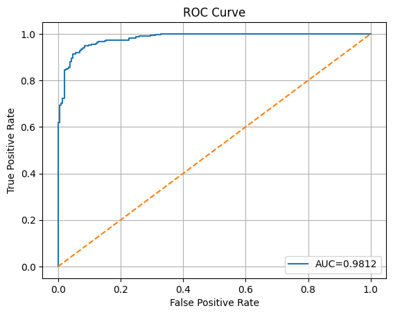
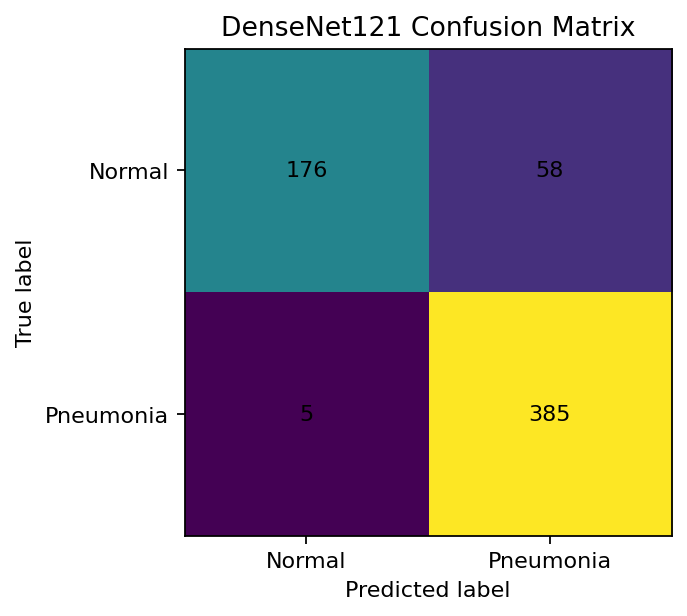
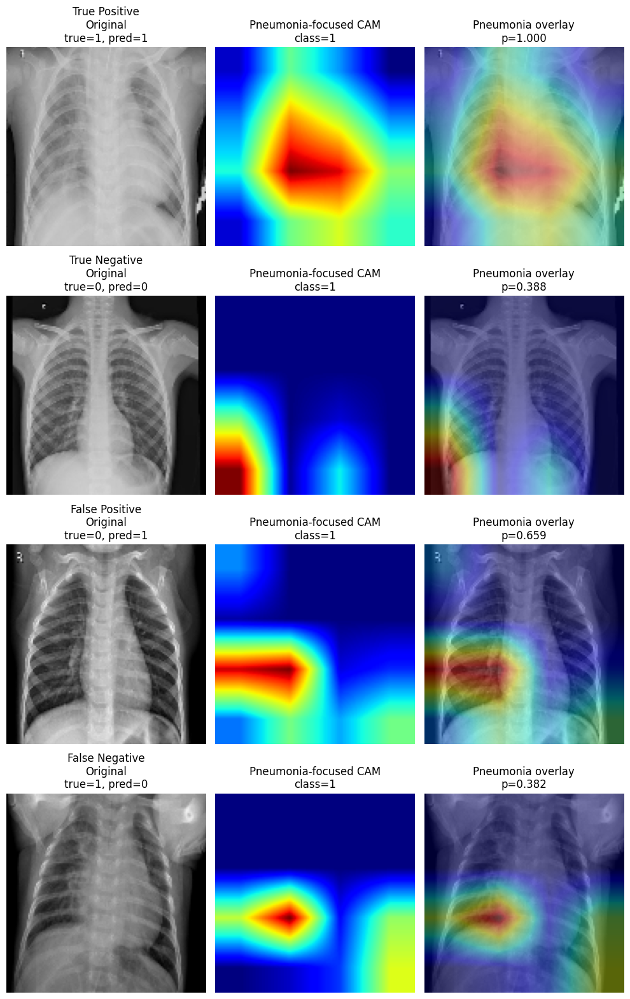
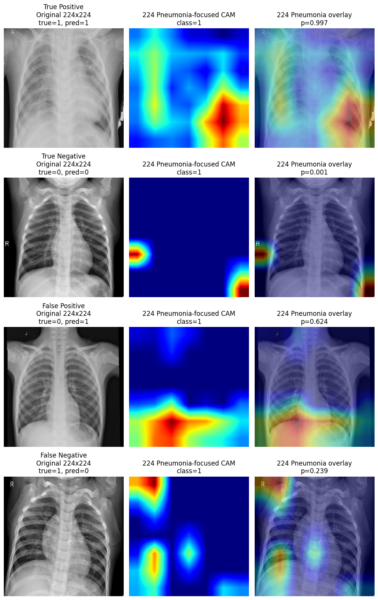
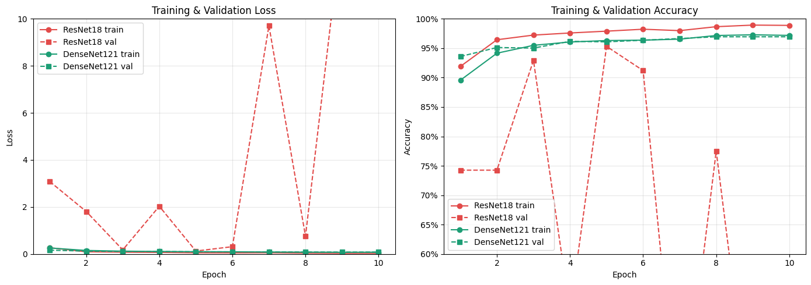

# Pneumonia X-ray Classification with Grad-CAM

## Overview

This public repository summarizes a chest X-ray classification project for binary pneumonia detection. The full course notebook is kept private, while this showcase version presents the project motivation, modeling approach, evaluation metrics, and selected output figures.

The project compares several deep learning models for classifying chest X-ray images as pneumonia or normal. The main goal was not only predictive accuracy, but also medically meaningful evaluation and interpretability.

## Methods

The project compared the following models:

- Custom CNN baseline
- ResNet-like residual CNN
- ResNet18-style CNN
- DenseNet121 with ImageNet transfer learning
- Extra 224×224 DenseNet121 experiment for clearer Grad-CAM visualization

## Evaluation Metrics

Because this is a medical screening task, accuracy alone is not enough. The project evaluated:

- Accuracy
- Precision
- Recall / sensitivity
- Specificity
- False negative rate
- ROC-AUC

Recall and false negative rate were especially important because a false negative means a pneumonia case is missed.

## Key Results

The best-performing model was DenseNet121 with transfer learning. Manual pneumonia-class evaluation on the test set gave:

| Metric | Value |
|---|---:|
| Accuracy | 0.8990 |
| Precision | 0.8691 |
| Recall / Sensitivity | 0.9872 |
| Specificity | 0.7521 |
| False Negative Rate | 0.0128 |
| ROC-AUC | 0.9812 |
| True Negative | 176 |
| False Positive | 58 |
| False Negative | 5 |
| True Positive | 385 |

The model achieved high pneumonia recall, missing only 5 pneumonia cases in the test set. Specificity was lower, meaning the model produced more false positives. For a screening-oriented task, this sensitivity-focused tradeoff can be reasonable because missed pneumonia cases are more costly than additional follow-up checks.

## Selected Figures

### ROC Curve

### Confusion Matrix

### Pneumonia-Focused Grad-CAM, 128×128

### Pneumonia-Focused Grad-CAM, 224×224

### Training Curves

## Interpretation

DenseNet121 generalized better than the custom CNN and ResNet-style models, likely because ImageNet transfer learning provided stronger visual feature representations.

The manual pneumonia-class metrics are more useful than raw built-in softmax precision/recall because the clinical goal is specifically to identify pneumonia cases. DenseNet121 achieved high sensitivity and low false negative rate, which are important for a medical screening task.

Grad-CAM was used as a qualitative interpretability tool. It does not prove clinical reasoning, but it helps check whether the model appears to focus on relevant image regions rather than unrelated artifacts.

## Private Code Notice

This public version contains only selected summaries and output figures. The full notebook and course implementation are kept private because the project was originally completed as a school project.

## Skills Demonstrated

- Python
- TensorFlow / Keras
- CNN image classification
- Transfer learning
- ROC-AUC and classification metrics
- Grad-CAM interpretability
- Medical-image model evaluation
